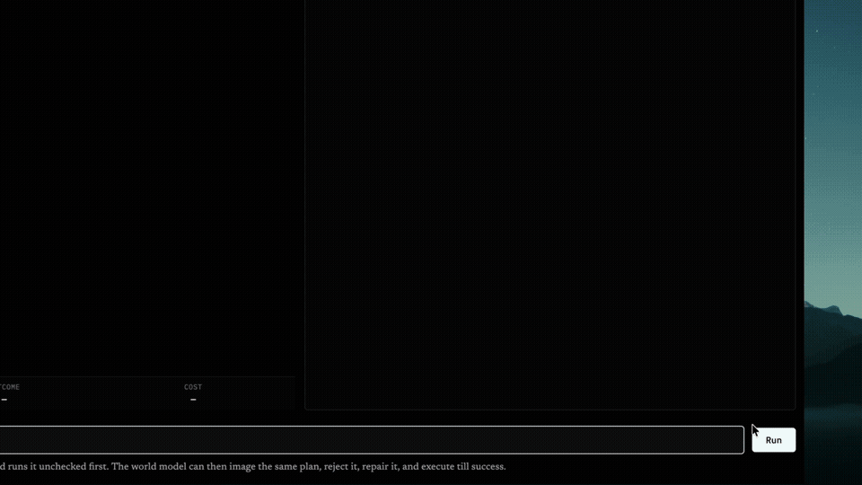
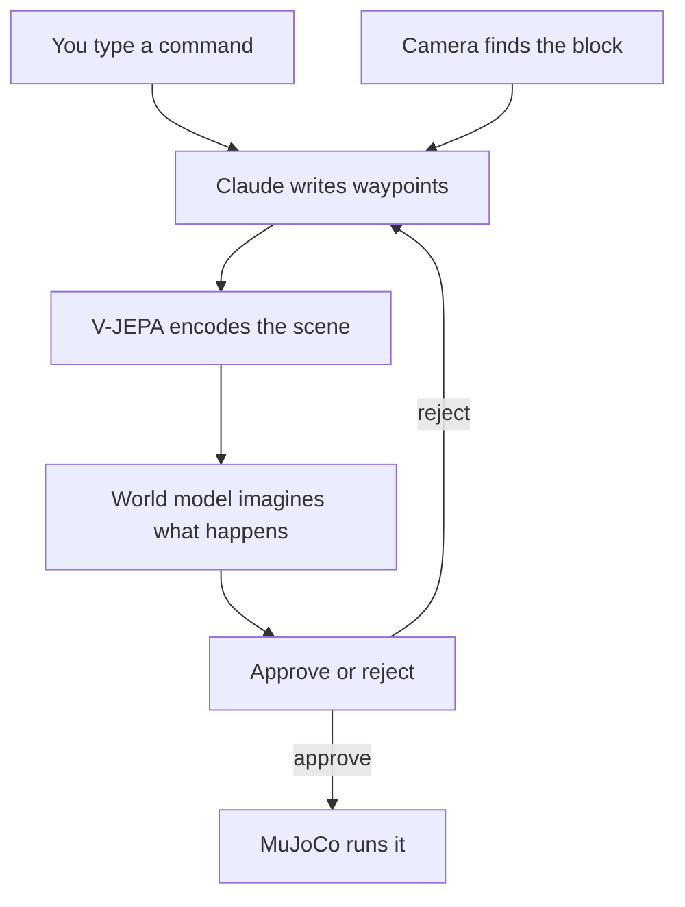

# PREVUE — Pre-execution Visual Understanding Engine

[](PREVUE.mp4)

Language-conditioned pick-and-place with a visual world-model verifier.

This is a robot pick-and-place stack in MuJoCo. You give it a command in plain English. Claude turns that into a structured waypoint plan. Before the arm moves, a verifier imagines what the plan will do — will the block lift, will it land on the pad, what breaks — and sends the plan back for repair if it looks wrong. The browser demo runs world model vs baseline side by side on the same plan so you can see the difference.

I built this to answer one question:

Before the robot moves, can you imagine the plan and catch the failure?

A UR5e arm picks and places blocks in MuJoCo. Claude writes the plan. A learned verifier looks at the scene, rolls the plan forward in its head, and says yes or no. If it's no, Claude gets one repair and tries again. Only then does the arm move.

The harder question underneath: does actually looking at the scene beat a geometry rule that never sees a pixel? So far the honest answer is: verification helps a lot. Pure vision hasn't won yet.

## How it works



Three modes:

| mode | what happens |
| --- | --- |
| `none` | runs whatever Claude said — no check |
| `rules` | geometry checks only, no image |
| `world-model` | learned imagined future from the camera |

The browser demo puts world model and baseline side by side on the same plan.

## Try it (~2 min if deps are installed)

```bash
git clone https://github.com/Trolleroof/skill-level-world-model.git
cd skill-level-world-model
uv sync
uv run python -m waddle_wm.server
```

Open http://127.0.0.1:8420. Type a task — `put the red block on the green pad`, or something compound like `put the red block on the green pad then put the blue block on the green pad`.

You word the task. The harness then breaks it on purpose, and the page shows you both halves of the result:

- **Before · unverified** — the flawed plan run with no checking at all. This is the failure, on video.
- **After · verified, fresh scene** — the repaired plan, re-run from the identical seed and block position with nothing carried over from the crash.

The page switches to **After** on its own when the verified run lands. **Before** stays one click away, so you are always one tab from the failure the verification prevented.

### The flaw is sampled, not scripted

A demo that always injects the same +6 cm looks like a verifier that memorised one number. So every run draws a fresh flaw ([`waddle_wm/chaos.py`](waddle_wm/chaos.py)) — a random direction and magnitude, from one of these:

| kind | what goes wrong |
| --- | --- |
| `random_grasp` | grasp aimed 3.5–7 cm off the block, random heading |
| `random_place` | release 12–22 cm off the pad, random heading |
| `toward_neighbor` | grasp nudged 1.5–2.5 cm toward a crowding block — *inside* the geometry tolerance, fatal in physics |
| `wrong_object` | grasp built from a different block's detection |
| `stale_grasp` | plan built from where the block was before an earlier action moved it |
| `perception_lie` | the detector reports the block 3.5–7 cm from where it is |
| scene challenges | a crowding neighbour, an occluder, a post in the carry lane, a slippery block with a weak gripper, a heavy block on a bouncy contact, a shifted camera |

Roughly 70% of runs break the plan, 30% leave the coordinates correct and break the *world* instead. The trace names the draw honestly — `perception_lie: 5.9 cm at 111°` — so a recording never overstates what was tested.

**The failure is measured, not assumed.** A sampled flaw is only kept once the unverified baseline has actually missed in MuJoCo; if it survives, the harness resamples (up to 5 draws). So "verification prevented this" is never a claim about a plan that would have worked anyway.

### It keeps asking until the verifier says yes

A rejected plan is not the end of the run. The loop keeps going back to Claude — up to `--persistence` plans per step, default 6 — and the arm does not move until one is approved.

The repair prompt says *change exactly one thing*, which is right the first time and a rut by the third: the probability drifts sideways (3% → 39% → 37%) while the same waypoint gets nudged. So once two repairs have failed, or the probability stops moving, the step is **re-proposed from scratch** with every rejection so far attached, so the model can see the pattern instead of editing its last answer again.

Two things stop the loop early, both on purpose:

- **A rewrite that cannot be scored is a rejection, not a free pass.** A from-scratch proposal can drop the eight-phase pick-and-place shape, which makes the verifier skip it — and a skipped plan used to execute unchecked. It now counts as a rejection with the required shape spelled out.
- **A converged planner stops.** If Claude hands back a program the verifier has already refused, more turns cost tokens and change nothing. The run ends with `planner converged`, and nothing executes.

That last case is worth watching for, because it is where this checkpoint's limit shows: on `blue block → red block` stacks the planner converges on a correct-looking program (grasp on the block centre, release at stack height) that the world model scores ~0.39 and refuses. The planner is not the problem there; the verifier is.

One honest caveat: on scene-only draws the baseline fails for a physics reason, and the repair that fixes it can be incidental rather than targeted. The trace shows every attempt, so you can tell which is which.

No checkpoint? Still works:

```bash
uv run python -m waddle_wm.server --verifier rules
```

Headless:

```bash
uv run python -m waddle_wm.agent --instruction "put the red block on the green pad"
```

## The demo that actually measures it

One bad plan. Three arms. Same scene. Real physics.

```bash
uv run python -m waddle_wm.demo
```

The `none` arm runs the flawed plan with zero verification. That's the point — you see what verification prevented, not just what you hope it prevented.

Replay without calling Claude again:

```bash
uv run python -m waddle_wm.demo --replay results/demo
```

### What happened (grasp aimed 6 cm past the block)

| arm | result |
| --- | --- |
| none | failed — block barely moved, 0.51 m from the pad |
| rules | caught it, repaired, landed 0.023 m from pad |
| world-model | caught it (p=0.073), repaired, landed 0.023 m from pad |

Over 8 scenes:

| arm | success rate |
| --- | --- |
| none | 0/8 |
| rules | 7/8 |
| world-model | 6/8 |

Both verifiers caught the bad plan every time. Geometry still wins on success rate. Full breakdown: [`docs/demo.md`](docs/demo.md).

## What I learned

Checking before you run is worth it. 0/8 without verification. 6–7/8 with it. The loop is real: camera → Claude → imagined outcome → repair → physics. No cheating with simulator state.

The probability is good at saying "this plan is broken." Separation AUC is 1.000 on flawed vs plausible opening plans ([`docs/verifier_characterisation.md`](docs/verifier_characterisation.md)). It's not a confidence score. Don't treat it like one.

Vision hasn't beaten coordinates on the main task. Rules beat the learned model on the demo (0.88 vs 0.75). That's the headline, and I'm not hiding it.

Vision does win in one narrow setup — when block orientation actually matters and you build the corpus that way ([`docs/task_suite_world_model.md`](docs/task_suite_world_model.md)). Shows it's possible. Doesn't mean it wins everywhere.

Still weak: grasp misses slip through, the model sometimes refuses good repairs, and imagined block positions can be ~20 cm off. Read the probability, not the coordinate.

Free check, no GPU, no Claude:

```bash
uv run python -m waddle_wm.analyse_separation
```

## Train your own checkpoint (optional, ~afternoon)

`models/` is gitignored. You need `models/multiblock_world_model.pt` for the full world-model path, plus the V-JEPA encoder (~1.3 GB, see [`docs/backbone_decision.md`](docs/backbone_decision.md)).

```bash
uv run python -m waddle_wm.sim.generate_dataset --episodes 5000 --out data/ur5e_wm_wide
uv run python -m waddle_wm.embed_windows --data data/ur5e_wm_wide
uv run python -m waddle_wm.train_latent_dynamics --data data/ur5e_wm_wide --out models/latent_dynamics_wide.pt
uv run python -m waddle_wm.train_multiblock_world_model \
    --data data/ur5e_wm_multiblock --out models/multiblock_world_model.pt
```

## Read more

| doc | why open it |
| --- | --- |
| [`docs/demo.md`](docs/demo.md) | what the demo proves and what it doesn't |
| [`waddle_wm/chaos.py`](waddle_wm/chaos.py) | every flaw the browser demo can sample, and why each one fails |
| [`docs/verifier_characterisation.md`](docs/verifier_characterisation.md) | what the probability actually means |
| [`docs/llm_agent.md`](docs/llm_agent.md) | planner, camera, repair loop |
| [`docs/results.md`](docs/results.md) | offline numbers |
| [`docs/project.md`](docs/project.md) | the full research framing |

Claude runs through the CLI on your machine (`claude -p`), not a separate API key.
