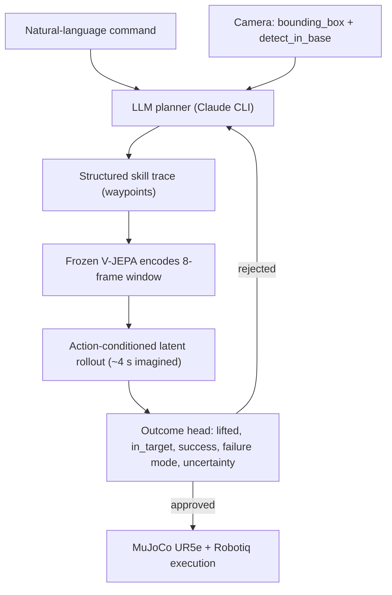

# Language-Conditioned Pick-and-Place with a Visual World-Model Verifier

A UR5e arm does tabletop pick-and-place in MuJoCo. Claude writes the plan as a structured waypoint program. Before anything moves, a learned verifier encodes the scene with a frozen V-JEPA 2 trunk, rolls the proposed plan forward in latent space, and predicts what will happen — so a plan that would fail can be rejected and handed back to Claude for one targeted repair.

The research question is narrower than "build a world model":

> Does *imagining the plan visually* catch failures that a coordinate-only geometry rule misses?

Everything here is measured against that question, including the parts where the answer is no.

## Architecture

Same overall shape as [SC3-style verification](https://weichengtseng.github.io/sc3-eval/): propose, imagine, repair, execute. The world model stays at the skill-planning layer; it never sits in the low-level servo loop.



At inference the planner only sees detections from the rendered camera — no privileged simulator state. Compound instructions decompose into atomic steps; the scene is observed again between steps.

### Three verifier modes

| mode | what it checks |
| --- | --- |
| `none` | schema validation only — baseline, runs whatever the LLM proposed |
| `rules` | deterministic geometry: grasp offset, pad distance, workspace, IK |
| `world-model` | learned imagined future from V-JEPA latents + latent dynamics |

The browser demo runs **world model vs baseline** side by side on the same Claude plan so the comparison is apples to apples.

## Setup

Python 3.11+, [uv](https://docs.astral.sh/uv/), and the Claude CLI logged in on the machine (the planner shells out to `claude -p`, no separate API key).

```bash
git clone https://github.com/Trolleroof/skill-level-world-model.git
cd skill-level-world-model
uv sync
```

`models/` is gitignored. The world-model verifier needs `models/multiblock_world_model.pt` plus the frozen encoder at `models/vjepa2-vitl-fpc64-256/` (~1.3 GB — see [`docs/backbone_decision.md`](docs/backbone_decision.md)). Modes that skip the checkpoint:

```bash
uv run python -m waddle_wm.server --verifier none    # LLM only
uv run python -m waddle_wm.server --verifier rules   # geometry rules
```

**Free sanity check — no checkpoint, no GPU, no Claude:**

```bash
uv run python -m waddle_wm.analyse_separation
```

Prints separation AUC, ranking AUC, and the pooled figure the docs tell you not to cite. `--out docs/verifier_separation.md` writes the report to a file.

## Interactive demo

```bash
uv run python -m waddle_wm.server
```

Open http://127.0.0.1:8420 — type an instruction, watch the left pane (world model) and right pane (baseline) run the same plan. The trace panel streams propose → imagined verdict → repair → execution as SSE events. Recorded episodes land in `results/agent/`.

Headless version:

```bash
uv run python -m waddle_wm.agent --instruction "put the red block on the green pad"
```

## The packaged benchmark demo

One deliberately flawed opening plan, three verifier arms, identical scenes, real physics:

```bash
uv run python -m waddle_wm.demo                       # all three arms; needs a checkpoint
uv run python -m waddle_wm.demo --arm none --arm rules  # no checkpoint needed
uv run python -m waddle_wm.demo --sweep 8             # rate table over 8 scenes
```

About 40 s and ~$0.19 on Claude Opus 5. Traces and videos go to `results/demo/`. Replay without spending tokens:

```bash
uv run python -m waddle_wm.demo --replay results/demo
```

Build a standalone page from saved traces:

```bash
uv run python -m waddle_wm.build_experiment_page
open results/demo/experiment.html
```

### Headline result (grasp miss — fingers aimed 6 cm past the block)

| verifier | opening verdict | MuJoCo outcome |
| --- | --- | --- |
| none | not verified | **failure** — block nudged, 0.51 m from pad |
| rules | reject (grasp misses) → repair → approve | **success**, 0.023 m from pad |
| world-model | reject p=0.073 → repair → approve p=0.947 | **success**, 0.023 m from pad |

Over 8 scenes (`grasp_miss` and `place_miss`):

| scenario | verifier | caught flawed plan | success rate |
| --- | --- | --- | --- |
| grasp_miss | none | 0/8 | 0.00 |
| grasp_miss | rules | 8/8 | 0.88 |
| grasp_miss | world-model | 8/8 | 0.75 |
| place_miss | none | 0/8 | 0.00 |
| place_miss | rules | 8/8 | 0.88 |
| place_miss | world-model | 8/8 | 0.75 |

The `none` arm executes the flawed plan unverified — that is what makes this a claim rather than an anecdote.

## Evaluate

**Verification is worth having.** Both verifiers catch the bad opening plan every time; unverified runs fail 0/8.

**The learned verifier is a reliable defect gate.** Over 63 opening plans, scripted-flawed plans score p ∈ [0.013, 0.207] and model-authored plans p ∈ [0.441, 0.981] — separation AUC 1.000, no overlap ([`docs/verifier_characterisation.md`](docs/verifier_characterisation.md) §1). It is not a calibrated outcome predictor; read the probability as a gate, not a confidence score.

**Vision has not beaten coordinates on the main line of work.** The geometry rule beats the learned model on the demo sweep (0.88 vs 0.75) and ties a plan-only control offline ([`docs/results.md`](docs/results.md) §3).

**One place vision does win.** A yaw-aware verifier on a task suite where block heading is decisive beats a no-vision control by +0.217 AUC on the orientation slice ([`docs/task_suite_world_model.md`](docs/task_suite_world_model.md) §6). That corpus was built so heading matters; it shows vision *can* read what coordinates omit, not that orientation decides most real picks.

Known weak axes: grasp-failure detection (`lifted` accuracy 0.720), false-reject rate 0.679 on held-out multi-block data, imagined block position ~0.2 m off (read the probability, never the coordinate).

Full honest reading: [`docs/demo.md`](docs/demo.md) §4.

## Train the world model (optional)

`data/` and `models/` are gitignored. Regenerate from scratch:

```bash
uv run python -m waddle_wm.sim.generate_dataset --episodes 5000 --out data/ur5e_wm_wide
uv run python -m waddle_wm.embed_windows --data data/ur5e_wm_wide
uv run python -m waddle_wm.train_latent_dynamics --data data/ur5e_wm_wide --out models/latent_dynamics_wide.pt
uv run python -m waddle_wm.report_metrics --data data/ur5e_wm_wide \
    --checkpoint models/latent_dynamics_wide.pt --out results/latent_dynamics_wide.json
```

Multi-block checkpoint the live agent defaults to:

```bash
uv run python -m waddle_wm.train_multiblock_world_model \
    --data data/ur5e_wm_multiblock --out models/multiblock_world_model.pt
```

Offline verifier sanity check (no Claude):

```bash
uv run python -m waddle_wm.test_verifier --multiblock 3
uv run python -m waddle_wm.test_agent --live 30 --checkpoint models/multiblock_world_model.pt
```

## What works and what does not

**Works**

- End-to-end closed loop: camera → LLM → imagined future → repair → MuJoCo, no cheat-state in the decision path.
- Pre-execution verification turns guaranteed failures into successes (0/8 unverified → 6–7/8 verified on the demo sweep).
- Repairs are targeted — Claude changes the waypoint the verdict named, not random resampling.
- Uncertainty rises on contested verdicts and drops on confident approvals.

**Does not (yet)**

- Vision beating geometry on the same scenes. Rules win the demo; the visual model is conservative and sometimes refuses good repairs.
- Multi-object manipulation at scale — trained mainly on red-block-to-green-pad; other color pairs can false-approve.
- Grasp misses — the outcome head underweights whether the fingers actually closed on the block.

## Docs map

| doc | contents |
| --- | --- |
| [`docs/project.md`](docs/project.md) | framing, baselines, open problems |
| [`docs/verifier_characterisation.md`](docs/verifier_characterisation.md) | what the probability is good for (gate vs confidence) |
| [`docs/llm_agent.md`](docs/llm_agent.md) | planner, perception primitives, repair loop |
| [`docs/demo.md`](docs/demo.md) | reproducible demo + honest reading |
| [`docs/results.md`](docs/results.md) | offline verifier metrics |
| [`docs/task_suite_world_model.md`](docs/task_suite_world_model.md) | yaw-aware verifier on orientation-heavy corpus |
| [`docs/program_schema.md`](docs/program_schema.md) | bounded program schema for candidate ranking |
| [`waddle_wm/sim/README.md`](waddle_wm/sim/README.md) | MuJoCo env and dataset generation |

## About

MuJoCo UR5e pick-and-place environment, frozen V-JEPA 2 latents, and a small learned verifier wired into an LLM repair loop. Built to test whether imagining a skill trace before running it reduces real execution failures — and to measure exactly where that breaks down.
