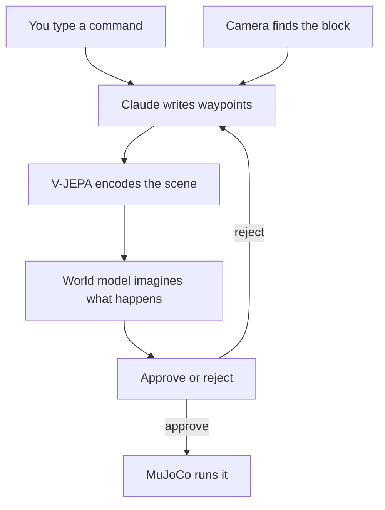

# Language-Conditioned Pick-and-Place with a Visual World-Model Verifier

This is a robot pick-and-place stack in MuJoCo. You give it a command in plain English. Claude turns that into a structured waypoint plan. Before the arm moves, a verifier imagines what the plan will do — will the block lift, will it land on the pad, what breaks — and sends the plan back for repair if it looks wrong. The browser demo runs world model vs baseline side by side on the same plan so you can see the difference.

I built this to answer one question:

Before the robot moves, can you imagine the plan and catch the failure?

A UR5e arm picks and places blocks in MuJoCo. Claude writes the plan. A learned verifier looks at the scene, rolls the plan forward in its head, and says yes or no. If it's no, Claude gets one repair and tries again. Only then does the arm move.

The harder question underneath: does actually looking at the scene beat a geometry rule that never sees a pixel? So far the honest answer is: verification helps a lot. Pure vision hasn't won yet.

## How it works



Three modes:

| mode | what happens |
| --- | --- |
| `none` | runs whatever Claude said — no check |
| `rules` | geometry checks only, no image |
| `world-model` | learned imagined future from the camera |

The browser demo puts world model and baseline side by side on the same plan.

## Try it (~2 min if deps are installed)

```bash
git clone https://github.com/Trolleroof/skill-level-world-model.git
cd skill-level-world-model
uv sync
uv run python -m waddle_wm.server
```

Open http://127.0.0.1:8420. Type something like `put the red block on the green pad`. Left pane = world model. Right pane = baseline. Same plan, different outcome.

No checkpoint? Still works:

```bash
uv run python -m waddle_wm.server --verifier rules
```

Headless:

```bash
uv run python -m waddle_wm.agent --instruction "put the red block on the green pad"
```

## The demo that actually measures it

One bad plan. Three arms. Same scene. Real physics.

```bash
uv run python -m waddle_wm.demo
```

The `none` arm runs the flawed plan with zero verification. That's the point — you see what verification prevented, not just what you hope it prevented.

Replay without calling Claude again:

```bash
uv run python -m waddle_wm.demo --replay results/demo
```

### What happened (grasp aimed 6 cm past the block)

| arm | result |
| --- | --- |
| none | failed — block barely moved, 0.51 m from the pad |
| rules | caught it, repaired, landed 0.023 m from pad |
| world-model | caught it (p=0.073), repaired, landed 0.023 m from pad |

Over 8 scenes:

| arm | success rate |
| --- | --- |
| none | 0/8 |
| rules | 7/8 |
| world-model | 6/8 |

Both verifiers caught the bad plan every time. Geometry still wins on success rate. Full breakdown: [`docs/demo.md`](docs/demo.md).

## What I learned

Checking before you run is worth it. 0/8 without verification. 6–7/8 with it. The loop is real: camera → Claude → imagined outcome → repair → physics. No cheating with simulator state.

The probability is good at saying "this plan is broken." Separation AUC is 1.000 on flawed vs plausible opening plans ([`docs/verifier_characterisation.md`](docs/verifier_characterisation.md)). It's not a confidence score. Don't treat it like one.

Vision hasn't beaten coordinates on the main task. Rules beat the learned model on the demo (0.88 vs 0.75). That's the headline, and I'm not hiding it.

Vision does win in one narrow setup — when block orientation actually matters and you build the corpus that way ([`docs/task_suite_world_model.md`](docs/task_suite_world_model.md)). Shows it's possible. Doesn't mean it wins everywhere.

Still weak: grasp misses slip through, the model sometimes refuses good repairs, and imagined block positions can be ~20 cm off. Read the probability, not the coordinate.

Free check, no GPU, no Claude:

```bash
uv run python -m waddle_wm.analyse_separation
```

## Train your own checkpoint (optional, ~afternoon)

`models/` is gitignored. You need `models/multiblock_world_model.pt` for the full world-model path, plus the V-JEPA encoder (~1.3 GB, see [`docs/backbone_decision.md`](docs/backbone_decision.md)).

```bash
uv run python -m waddle_wm.sim.generate_dataset --episodes 5000 --out data/ur5e_wm_wide
uv run python -m waddle_wm.embed_windows --data data/ur5e_wm_wide
uv run python -m waddle_wm.train_latent_dynamics --data data/ur5e_wm_wide --out models/latent_dynamics_wide.pt
uv run python -m waddle_wm.train_multiblock_world_model \
    --data data/ur5e_wm_multiblock --out models/multiblock_world_model.pt
```

## Read more

| doc | why open it |
| --- | --- |
| [`docs/demo.md`](docs/demo.md) | what the demo proves and what it doesn't |
| [`docs/verifier_characterisation.md`](docs/verifier_characterisation.md) | what the probability actually means |
| [`docs/llm_agent.md`](docs/llm_agent.md) | planner, camera, repair loop |
| [`docs/results.md`](docs/results.md) | offline numbers |
| [`docs/project.md`](docs/project.md) | the full research framing |

Claude runs through the CLI on your machine (`claude -p`), not a separate API key.
